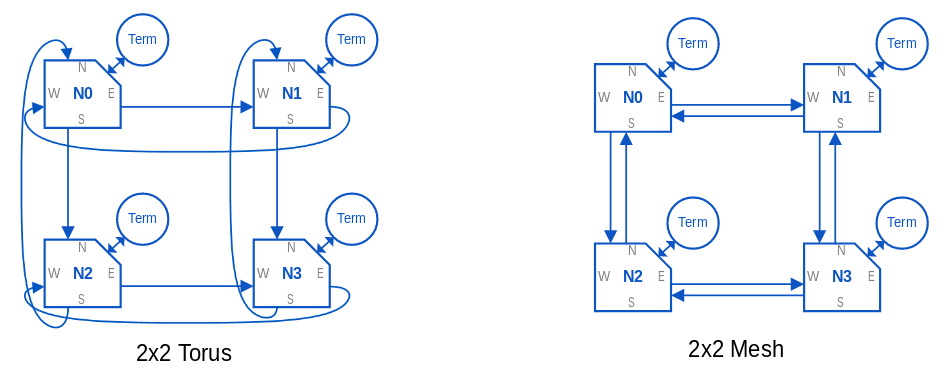
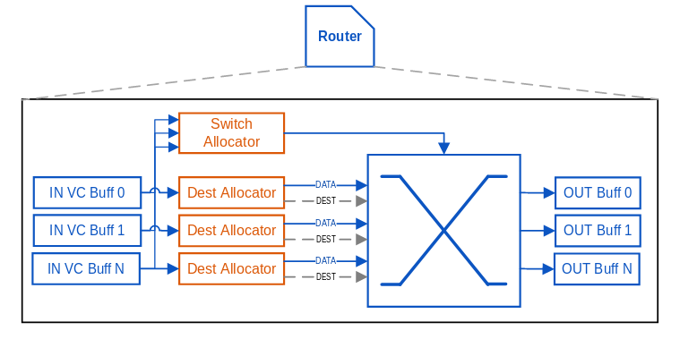

## AXI4-Stream Crossbars

This folder contains a collection of crossbars for various purposes 

### Non-Configurable, Statically Mapped Crossbars

#### axis_ctrl_crossbar_2d_mesh

This crossbar has been optimized for low-throughput control and can scale to a
large number of ports. The underlying implementation uses a 2-dimensional mesh
topology which can be configured either as a bidirectional mesh or a 
unidirectional torus. The crossbar is not deadlock free by design but there are
various features implemented that reduce the possibility of deadlock. In the
event of a deadlock the crossbar will self-recover by dropping all the packets
in flight. This behaviour makes the crossbar lossy. The underlying mesh topology
can only be a square so the number of ports supported are N^2 for N > 1. All
unused ports need to be terminated using the axis_port_terminator module.

Each node in the crossbar is comprised of a terminal and a router. A terminal
is the interface to client logic and the network of routers performs 
packet switching. Each router in the crassbar has the following architecture:

It consists of:
- A switch to do the routing
- Ingress buffers with one or more virtual channels
- A switch allocator to choose an input port to drive the switch
- A destination selector to choose the destination port
- Egress buffers

### Configurable, Dynamically Mapped Crossbars

TBD